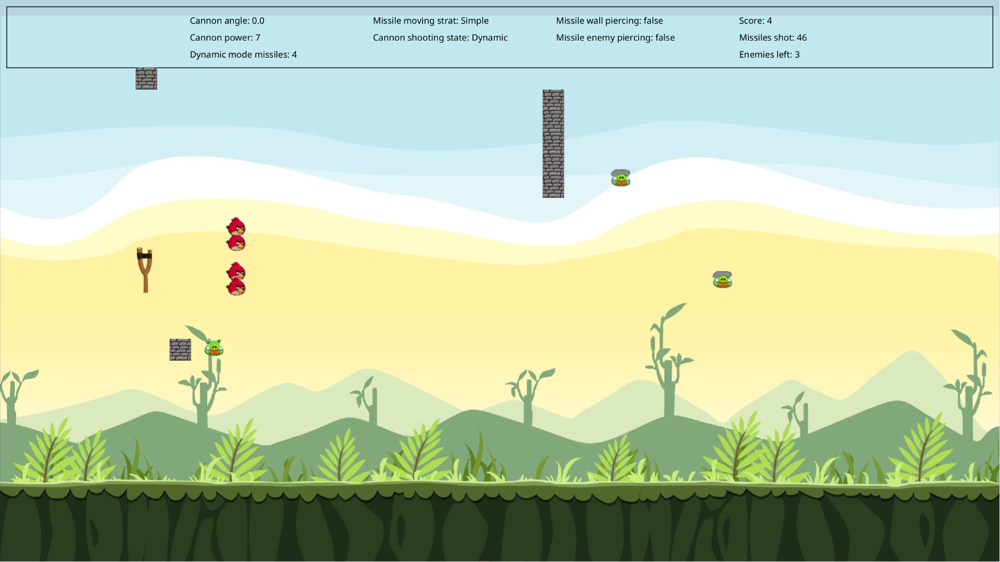

# Patterny Birds

The goal of this project was to get a hands-on experience with as many design patterns as possible.

Note that many parts of the project were not created by me,
as they were included in the project's initial template or supplied during practicals.
However, it was my responsibility to incorporate all the supplied changes into my codebase,
understand them and build upon them to create a comprehensive, working game.

---

    

